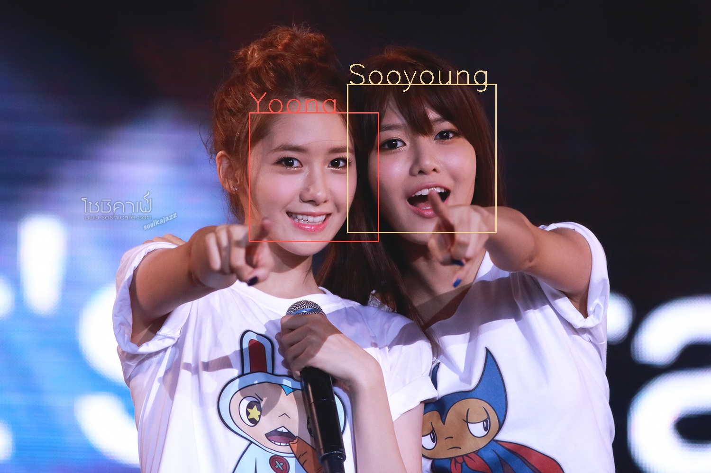

#少女時代の顔を識別するためのプログラム
* Cifar10で少女時代のメンバーを学習。  
* このプログラムは`caffe/examples/cifar10/`上で動作させることを想定
* 学習器の設定はこのレポジトリにある`snsd_cifar10_quick.prototxt`、Caffeモデルは`snsd_cifar10_quick_iter_4000.caffemodel`を指定
* 平均画像ファイルは`snsd_mean.binaryproto`

##snsd_classify.py
* 顔を切り取った写真を前提
* 一番もっともらしいメンバーの名前を表示
* その他のメンバーの確率も表示

###実行方法
```bash
cd python
python snsd_classify.py src.jpg
```

##snsd_facedetection.py
* OpenCVで入力画像から顔検出
* そのあと切り出した画像から、分類器にかける
* 一番確率の高かったメンバー名を画像に書きこむ

###実行方法
```bash
cd python
python snsd_facedetection.py src.jpg output.jpg
```

###実行結果



