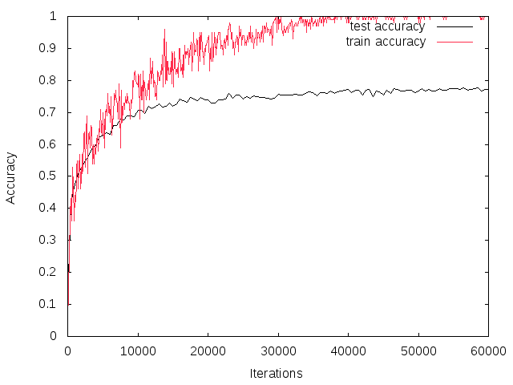

#Caffeを使って少女時代の顔を識別するためのプログラム
詳しい説明はブログにも書いているので参考にしてみてください．

* http://ry0.github.io/blog/2015/08/12/ubuntu-nvidia-cuda-7.0/
* http://ry0.github.io/blog/2015/08/15/caffe-install/
* http://ry0.github.io/blog/2015/08/22/create-dataset/
* http://ry0.github.io/blog/2015/09/28/caffe-deeplearning-dataset-1/
* http://ry0.github.io/blog/2015/09/28/caffe-deeplearning-dataset-2/
* http://ry0.github.io/blog/2015/09/30/using-summary-of-caffe/

ここからは簡単にこのリポジトリの概要のみ説明します．
* Cifar10の学習モデルをベースにして少女時代のメンバーを学習行った．  
* このプログラムは`caffe/examples/`上に`clone`してください．
```bash
cd caffe/examples/
git clone https://github.com/Ry0/snsd_classify.git
```

* 学習器の設定はこのレポジトリにある`snsd_cifar10_full.prototxt`、Caffeモデルは`snsd_cifar10_full_150717_iter_60000.caffemodel`を指定
* 平均画像ファイルは`snsd_mean.binaryproto`
* データセットは肖像権の関係で公開できませんが，すでに学習済みのモデルはこのレポジトリにおいています．
* したがって下のメンバー識別プログラムはデータセットを自分で用意しなくても実行できます．

##少女時代の顔を学習
少女時代の顔を切り出すプログラムによって大量のデータセットを作ってください．
このプログラムはここにあります．  
[https://github.com/Ry0/facedetection](https://github.com/Ry0/facedetection)  
[ここ](http://kivantium.hateblo.jp/entry/2015/02/20/214909)の「LevelDBデータセットの準備」の項を参照して，LevelDBを作成します．
ファイルはレポジトリ内の`snsd_data`に以下のようなフォルダ内容で作成．  
`snsd_data`の`build_leveldb.py`の45行目は自分のcaffeをおいているディレクトリを指定してください．

|メンバー名|フォルダ名|
|:--:|:--:|
|etc|0|
|ヒョヨン|1|
|ジェシカ|2|
|ソヒョン|3|
|スヨン|4|
|ソニ|5|
|テヨン|6|
|ティパニ|7|
|ユナ|8|
|ユリ|9|

```bash
cd snsd_data
python build_leveldb.py
```

`snsd_cifar10_test_leveldb`と`snsd_cifar10_train_leveldb`が`snsd_classify`のディレクリにできていることを確認した後，以下のコマンドを実行．
ただし実行する前に環境に応じて`snsd_cifar10_full_solver.prototxt`の最後の行をCPUかGPUを変更してください．

```bash
./train_full.sh
```

##snsd_classify.py
* 顔を切り取った写真を前提
* 一番もっともらしいメンバーの名前を表示
* その他のメンバーの確率も表示

###実行方法
```bash
cd python
python snsd_classify.py src.jpg
```

##snsd_facedetection.py
* OpenCVで入力画像から顔検出
* そのあと切り出した画像から、分類器にかける
* 1番確率の高かったメンバー名を画像に書きこむ
* 2番目，3番目の候補も下に表示

###実行方法
```bash
cd python
python snsd_facedetection.py src.jpg output.jpg
```
または
```bash
cd python
python snsd_facedetection.py src.jpg
```
出力先を指定しない場合は保存した時間を名前にして勝手に`success_img`というディレクトリにぶち込まれます．

実行すると「Show Image」と書かれたウィンドウが出現し，結果が可視化される．  
この結果を保存したかったらウィンドウ上で`s`キーを押す．保存したくなかったら`s`以外のキーを押すとプログラムが終了．

###実行結果
この結果は**データの水増し，Dropoutあり（後述）**の手法で学習させた結果です．


##Dropoutをいれた
Cifar10のモデルをそのまま使ったら，過学習が起きたので，これを軽減させるために，データをランダムにクロップして学習につかったり，画像を左右反転させたり，データの水増しをした．
あとDropoutと呼ばれるブロックを追加した．
このモデルは[dropout](https://github.com/Ry0/snsd_classify/tree/dropout)ブランチにそれ用の`.prototxt`があります．

###ノーマル
* バリバリ過学習が起きてる．
* テストデータに関する精度も77%程度



###データの水増し，Dropoutあり
* 過学習が抑えられている！！
* テストデータに関する精度も82%とノーマルのときよりも精度向上＼(^o^)／


##IPython Notebook
これらの結果をIPython Notebookを使って出力してみました．
中間層が見れたりします．

[https://github.com/Ry0/snsd_classify/blob/dropout/ipynb/snsd.ipynb](https://github.com/Ry0/snsd_classify/blob/dropout/ipynb/snsd.ipynb)
